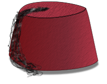

.. _fez:

FEZ: Font Engineering Made Easy
===============================

*I wear a fez now. Fezzes are cool.*

FEZ (Font Engineering made eaZy) is a language for creating font feature code.
It is an alternative to Adobe's AFDKO feature language, designed for handling
fonts with particularly complex layout. It is designed to be *expressive* and
*extensible*.

By *expressive*, we mean that FEZ aims to operate at a conceptually
higher level than AFDKO, and gives you simpler and more automated ways to express
what you want to achieve.

By *extensible*, we *expect* you to write your own extensions to the language in
Python to generate rules instead of hand-coding them, and provide facilities for
doing this. Indeed, any moderately complex font project can usually be simplified
by writing some of the rules as a FEZ extension.

We will see examples of both of these design goals throughout the manual.

.. toctree::
   :maxdepth: 2

   getting-started
   syntax
   optionalverbs
   plugins
